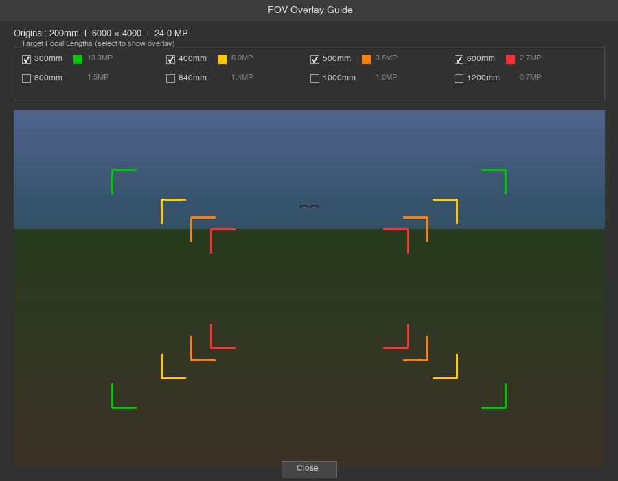

# FOV Overlay for Lightroom Classic

A plugin for Lightroom Classic (macOS and Windows) that shows graphical overlays indicating the equivalent field of view at different focal lengths when cropping an image.

Select a photo shot at a given focal length and instantly see crop rectangles for longer focal lengths — helping you decide how much to crop and what resolution you'll retain.



## Features

- Visualize crop areas for standard focal lengths (24mm–1200mm)
- **Full uncropped frame view** — see the original sensor frame with Lightroom crop visualized as a darkened overlay (supports angled crops)
- **Crop sensor support** — automatically uses 35mm equivalent focal length for correct FOV on APS-C, Micro Four Thirds, etc.
- Switch between **Full Frame** and **Cropped** views via dropdown
- Toggle individual focal lengths on/off with checkboxes
- See remaining megapixels for each crop level
- Highlight a specific crop with dimming outside the rectangle
- 10 distinct color-coded overlays at 50% opacity
- Screen-aware dialog sizing — fits any display
- One-click update checking from Plugin Manager

## Installation

1. **[Download the latest release](https://github.com/KalinKanev/lightroom-fov-overlay/releases/latest)** — download `fovoverlay.lrplugin.zip` from the Assets section.
2. Unzip to get the `fovoverlay.lrplugin` folder.
3. In Lightroom: `File > Plug-in Manager` — click `Add` and select the `fovoverlay.lrplugin` folder.

The download includes bundled ExifTool binaries for both macOS and Windows, required for the full uncropped frame view on RAW files.

To update, use the **Check for Updates** button in the Plugin Manager, or repeat the steps above and click `Reload Plug-in`.

## Usage

1. Select a photo in the **Library** module.
2. Go to `Library > Plug-in Extras > Show FOV Guides`.
3. The dialog shows your image with crop rectangles for focal lengths longer than what the photo was shot at.
4. Use the checkboxes to toggle individual focal lengths on or off.
5. Use the **View** dropdown to switch between Full Frame and Cropped views.
6. Use the **Highlight crop** dropdown to dim everything outside a specific focal length rectangle.
7. Click **Close** to dismiss the dialog.

### Cropped Images

If the selected photo has a Lightroom crop applied, the plugin automatically:
- Shows the **full uncropped frame** with the crop area highlighted (requires ExifTool, bundled in the release)
- Calculates the **equivalent focal length** based on the crop (e.g., a 200mm shot cropped to 50% width = 400mm equivalent)
- Lets you switch between Full Frame and Cropped views
- Supports angled/rotated crops (overlay positioning may be approximate for heavily tilted crops)

### Crop Sensor Cameras

The plugin reads the 35mm equivalent focal length from EXIF metadata. On crop sensor cameras (APS-C, Micro Four Thirds, etc.), the header shows both the actual lens focal length and the full-frame equivalent:

> Lens: 300mm (≈450mm FF) | 6000 × 4000 | 24.0 MP

FOV guide rectangles represent correct full-frame equivalent focal lengths regardless of sensor size.

### Understanding the Overlays

Each overlay rectangle shows how much of the current image you would need to crop to match the field of view of a longer focal length.

Each selected focal length gets a unique color from the palette: green, yellow, orange, red, cyan, magenta, blue, lime, pink, white.

## Requirements

- Lightroom Classic (LR 5.7+, LR 6, or any Creative Cloud subscription version)
- macOS or Windows

## How It Works

The plugin reads the photo's EXIF focal length (35mm equivalent when available) and image dimensions. For each target focal length, it computes:

```
Crop Ratio = Target FL / Original FL
Crop Width = Image Width / Crop Ratio
Crop Height = Image Height / Crop Ratio
```

The resulting rectangle is centered on the image and drawn as a colored outline.

For the full uncropped frame view, the plugin extracts the embedded JPEG preview from RAW files using ExifTool (bundled). For JPEG files, it uses the original file directly.

## Troubleshooting

### Full frame view not available

If you see "Full frame unavailable — showing cropped view only":
- Make sure the `bin` folder with ExifTool is present inside `fovoverlay.lrplugin`
- Re-download from the [latest release](https://github.com/KalinKanev/lightroom-fov-overlay/releases/latest) — use `fovoverlay.lrplugin.zip` (not "Source code")

### Tilted/angled crops

The crop overlay for angled crops is approximate. Heavily tilted crops may show slight misalignment between the overlay and the actual crop boundary.

### Dialog too large or Close button not visible

Make sure you're running the latest version. The plugin scales the dialog to fit your Lightroom window automatically.

## License

MIT License. See [LICENSE](LICENSE) for details.
